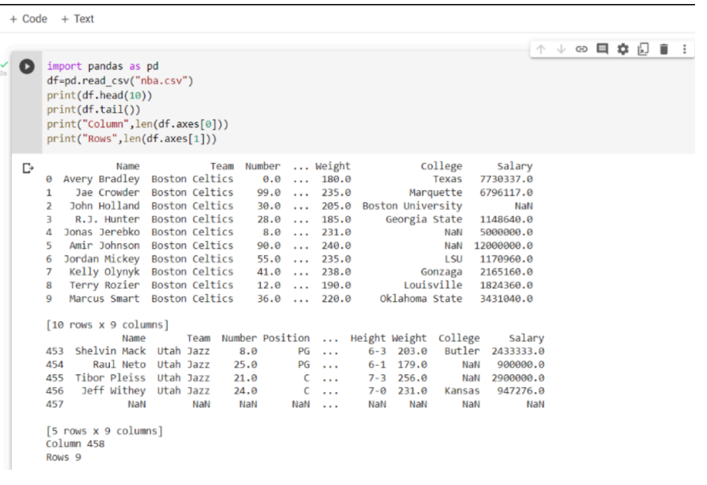

# Read-from-CSV

## AIM:

## ALGORITHM:
### Step 1:import pandas as pd
### Step 2:Read the csv file using read_csv method
### Step 3:Use head and tail method to get the required contents from the file.
### Step 4:Use len() method to get the number of rows and columns.
### Step 5:End of the program.

## PROGRAM:
```
 Developed by: Sarish Varshan V
 Register number:212223230196
 import pandas as pd
 df=pd.read_csv("nba.csv")
 print(df.head(10))
 print(df.tail())
 print("Column",len(df.axes[0]))
 print("Rows",len(df.axes[1]))
 ```

## OUTPUT:


## RESULT:
Thus the program is written to read the csv file
